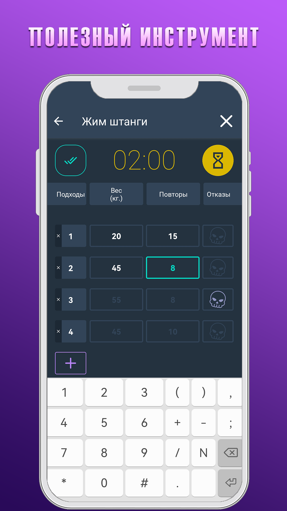
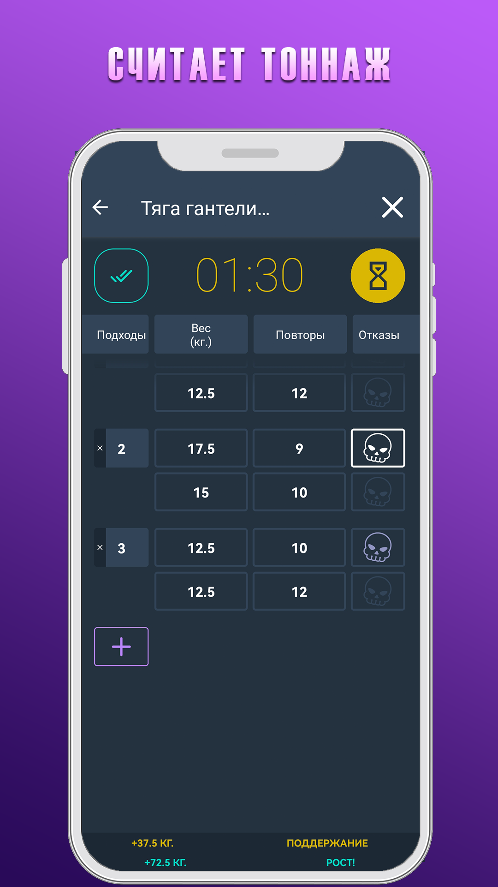
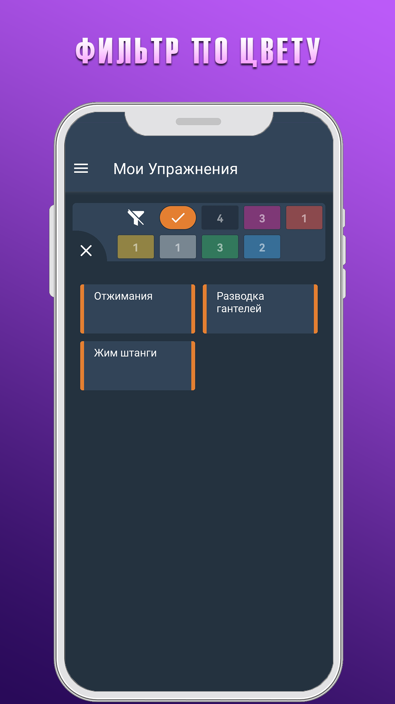
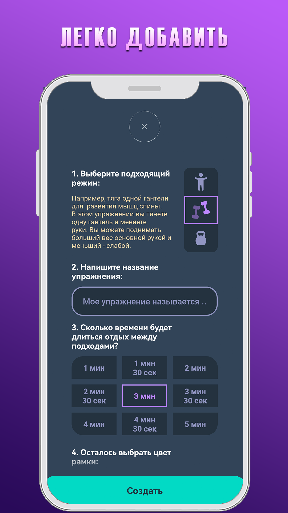
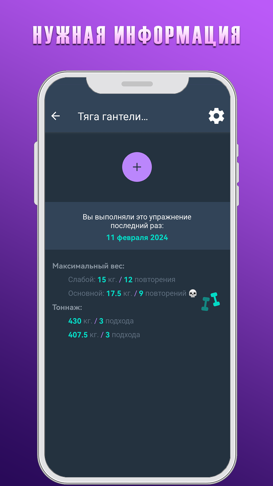

>### Тренировочный дневник для фитнеса

Приложение для Android. Подойдет тем, кто хочет попробовать профессиональные тренировки в тренажерном зале. Телефон можно взять с собой на тренировку. Используйте таймер для того, чтобы контролировать время отдыха между подходами и интенсивность ваших тренировок. Записывайте спортивные показатели: рабочий вес и количество повторений в каждом подходе. Индикатор будет считать тоннаж, сравнивать новое значение и предыдущее значение. Основная цель сделать 110% тоннаж с прошлой тренировки. Вы сможете увидеть результат выполнения каждого упражнения и идти в душ после тренировки с отлично выполненной работой

|  |  |
|:---:|:---:|
|  |  |
|  |  |
|  | |

## Особенности
- приложение содержит адаптационные (onboard) экраны
- интерфейс приложения доступен на русском и английском языках
- поддерживает ввод показателей в килограммах и фунтах
- возможность добавлять упражнения в список:
    - упражнения со свободным весом или инвентарем
    - упражнения с гантелями или вести параллельную запись
    - упражнения с весом собственного тела, с возможностью ввести актуальный вес тела перед очередным выполнением
- возможность ассоциировать упражнения с понравившимся цветом
- удобный таймер для контроля времени отдыха между подходами
- индикатор выполнения упражнения, который считает тоннаж и сравнивает значения
- информативный инструмент без встроенной рекламы

## Установка
1. скачайте архив или выполните команду `git clone`
2. поместите файл `evilplate_*.apk` в папку `Download` на вашем мобильном устройстве
3. выполните установку `evilplate_*.apk` на вашем мобильном устройстве
4. **начните пользоваться приложением**

## Дополнительно

Приложение называется **Evil Plate** (Рогатый блин для штанги)

Узнать больше про технологию **Expo** ([ссылка](https://docs.expo.dev/guides/overview/))